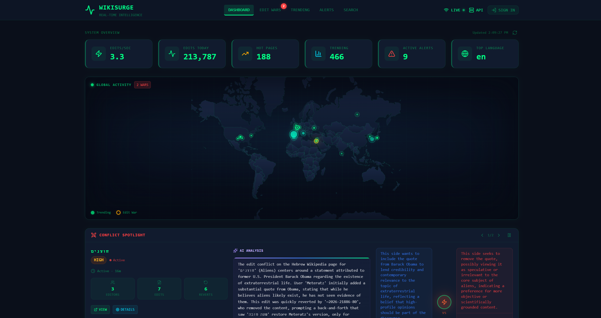
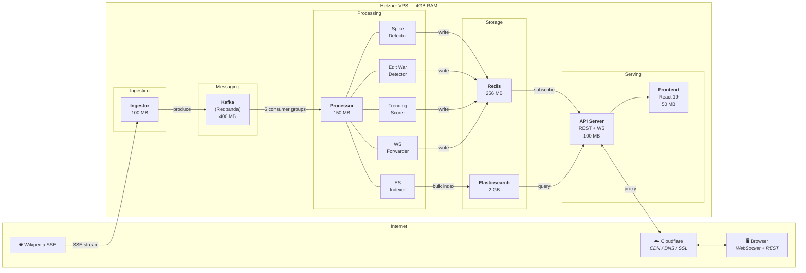

<div align="center">

# `WikiSurge`

### Real-Time Wikipedia Intelligence

[](https://go.dev)
[](https://react.dev)
[](https://www.typescriptlang.org)
[](https://redpanda.com)
[](https://redis.io)
[](https://elastic.co)
[](https://docker.com)

**A high-performance streaming pipeline that ingests every Wikipedia edit on Earth in real-time,<br/>detects anomalies, identifies edit wars, and explains conflicts using AI.**

[Dashboard](#-dashboard) · [How It Works](#-how-it-works) · [Architecture](#-architecture) · [Technical Decisions](#-technical-decisions) · [API](#-api-endpoints) · [Docs](#-documentation)

</div>

---

<div align="center">
<a href="docs/assets/dashboard_img.png">

</a>
<br/>
<sub><b>Live dashboard</b> — real-time edits monitor, geographic activity map, language distribution, spike alerts, trending pages, full-text search, and WebSocket-powered live feed · <i>click to expand</i></sub>
</div>

---

## What Is This

WikiSurge connects to Wikipedia's [EventStreams](https://stream.wikimedia.org/) SSE firehose and processes **every edit across all 300+ language editions** through a multi-stage streaming pipeline. It detects activity spikes, tracks trending pages, identifies edit wars in real-time, and uses LLMs to analyze what editors are actually fighting about — then surfaces everything through a WebSocket-powered cyberpunk dashboard and personalized email digests.

This isn't a toy project with a single API call. It's a distributed system with:

- **5 independent Go services** communicating through Kafka and Redis
- **Real-time spike detection** using sliding window statistics with Z-score thresholds
- **Edit war detection** with revert tracking, byte-delta analysis, and timeline reconstruction
- **AI-powered conflict analysis** that fetches Wikipedia diffs and explains both sides
- **Geographic activity map** plotting real-time edit hotspots and conflicts worldwide
- **Resilient architecture** with circuit breakers, graceful degradation, and automatic recovery
- **Sub-second WebSocket delivery** from Wikipedia edit → user's browser
- **Deployed on a single 4GB Hetzner VPS** with aggressive memory budgeting

---

## Features

<table>
<tr>
<td width="50%">

**Real-Time Monitoring**
- Live edit stream via WebSocket (Pub/Sub)
- Edits/second gauge with historical graph
- Language distribution across 300+ wikis
- Hot page tracking with promotion/demotion
- Global activity map with geographic hotspots

</td>
<td width="50%">

**Intelligence & Alerts**
- Spike detection with configurable Z-score thresholds
- Edit war detection with revert ratio tracking
- AI analysis explaining what editors fight about
- Severity classification (LOW / MEDIUM / HIGH / CRITICAL)
- Conflict spotlight carousel with auto-rotation

</td>
</tr>
<tr>
<td width="50%">

**Search & Discovery**
- Full-text search powered by Elasticsearch
- Advanced filters: date range, language, username, byte change
- Autocomplete search suggestions with debounced fetch
- Trending pages scored by recency-weighted edits
- CSV export (search results, edit wars, timelines)

</td>
<td width="50%">

**User System**
- JWT authentication with bcrypt password hashing
- Personalized watchlists (track specific pages)
- Daily/weekly email digests via Resend API
- Configurable digest content & spike thresholds
- Admin panel for user management

</td>
</tr>
<tr>
<td width="50%">

**Edit War Visualization**
- Sides matchup with color-coded position display
- Editor conflict graph with per-editor stats
- Historical edit wars browser with filtering & pagination
- Full edit timeline reconstruction
- Direct links to Wikipedia editor profiles

</td>
<td width="50%">

**Resilience & Performance**
- Circuit breaker pattern (open → half-open → closed)
- Graceful degradation manager (3 levels)
- Redis-backed sliding window rate limiting (per-endpoint)
- In-memory response cache with TTL (10K entry cap)
- Object pool reuse to reduce GC pressure

</td>
</tr>
</table>

### AI-Powered Edit War Analysis

<div align="center">
<a href="docs/assets/edit-wars.gif">

</a>
<br/>
<sub>LLM identifies opposing sides, editor roles, content area, severity, and explains the conflict in plain English · <i>click to expand</i></sub>
</div>

### Geographic Activity Map

The dashboard includes an interactive world map (`react-simple-maps`) that visualizes editing activity in real-time:

- **Hotspots** (green) — regions with high edit activity, sized by volume
- **Edit war markers** (orange/red) — active conflicts plotted by geographic origin, colored by severity
- **Click-to-navigate** — clicking a war marker scrolls to the Edit Wars tab with that conflict highlighted
- **Auto-refresh** — polls the `/api/geo-activity` endpoint every 15 seconds
- **Responsive** — adapts to desktop, tablet, and mobile viewports with zoom (1×–8×) and pan

The backend maps Wikipedia language editions to geographic centroids and returns hotspot/war coordinates with 30-second response caching.

---

## How It Works

Wikipedia publishes every edit happening across all its wikis as a Server-Sent Events stream. WikiSurge taps into this firehose and pushes each event through a pipeline:

```
Wikipedia SSE ──► Ingestor ──► Kafka ──► Processor ──► Redis / ES ──► API ──► Browser
   (global)       (filter)    (buffer)   (analyze)     (store)       (serve)  (display)
```

### The Pipeline, Step by Step

| Step | Component | What Happens |
|------|-----------|-------------|
| **1** | **Ingestor** | Connects to `stream.wikimedia.org` via SSE. Filters bot edits, validates schema, enforces rate limits (token bucket), enriches metadata. Produces to Kafka with batching. Auto-reconnects with exponential backoff. |
| **2** | **Kafka (Redpanda)** | Buffers events in `wikipedia.edits` topic with 24h retention. Decouples ingestion speed from processing speed. Dead letter queue at `wikipedia.edits.dlq` for poison messages. |
| **3** | **Spike Detector** | Maintains 1-hour sliding windows per page. Calculates running mean/stddev. Fires alert when current rate exceeds `mean + (Z × stddev)`. Configurable Z-score threshold (default: 3.0). |
| **4** | **Trending Scorer** | Scores pages using `edits × recency_weight × namespace_boost`. Recency decays exponentially. Scores stored in Redis Sorted Sets. Top-N retrieved in O(log N). |
| **5** | **Edit War Detector** | Tracks per-page editor sets, revert patterns, and byte-delta oscillations. When revert ratio exceeds threshold within a time window → flags as edit war. Stores full timeline in Redis Lists. |
| **6** | **ES Indexer** | Selectively indexes edits to Elasticsearch (not everything — that would be ~8M docs/day). Daily index rotation (`edits-2025-02-24`), 7-day retention, ILM policies. |
| **7** | **WS Forwarder** | Publishes every processed edit to Redis Pub/Sub channel. API server subscribes and fans out to all connected WebSocket clients. |
| **8** | **LLM Analysis** | On edit war detection → fetches actual text diffs from Wikipedia's MediaWiki API → builds structured prompt → GPT-4o identifies sides, roles, severity → caches in Redis. Heuristic fallback when no LLM configured. |
| **9** | **Email Digests** | Scheduler runs daily/weekly. Collects highlights from Redis. Personalizes per user (watchlist + preferences). Renders HTML email. Sends via Resend API with worker pool. |

---

## Architecture



**7 containers. ~3.1 GB total memory. One server. Zero managed services.**

---

## Tech Stack

<table>
<tr>
<td valign="top" width="33%">

### Backend
- **Go 1.24** — all 5 services
- **Goroutines + Channels** — concurrent processing
- **`net/http`** — HTTP server (no framework)
- **`gorilla/websocket`** — WebSocket connections
- **`zerolog`** — structured JSON logging
- **`go-sqlite3`** (CGO) — user database

</td>
<td valign="top" width="33%">

### Infrastructure
- **Kafka (Redpanda)** — message streaming
- **Redis 7** — hot data, pub/sub, streams
- **Elasticsearch 8** — full-text search
- **Docker** — multi-stage builds (~15MB images)
- **GitHub Actions** — CI/CD to GHCR
- **Coolify** — self-hosted PaaS on Hetzner

</td>
<td valign="top" width="33%">

### Frontend
- **React 19** + **TypeScript 5**
- **Vite** — build tooling
- **Tailwind CSS** — cyberpunk UI
- **Recharts** — real-time graphs
- **react-simple-maps** — geographic visualization
- **Zustand** — state management (persisted)
- **WebSocket** — live data feeds
- **Lazy loading** — code-split per tab

</td>
</tr>
<tr>
<td valign="top" width="33%">

### AI / Email
- **OpenAI GPT-4o-mini** — edit war analysis
- **Multi-provider** — Anthropic, Ollama support
- **Resend API** — transactional email
- **Go `html/template`** — email rendering

</td>
<td valign="top" width="33%">

### Auth & Security
- **JWT** (HMAC-SHA256) — stateless auth
- **bcrypt** — password hashing
- **Rate limiting** — per-IP sliding window
- **CORS / CSP / HSTS** — security headers
- **Request validation** — SQL injection detection
- **Body limits** — 1 MiB max request size

</td>
<td valign="top" width="33%">

### Monitoring
- **Prometheus** — metrics collection
- **Grafana** — dashboards & alerts
- **Loki + Promtail** — log aggregation
- **Custom health checks** — per-service

</td>
</tr>
</table>

---

## Technical Decisions

Things I built from scratch and why — the engineering choices that make this interesting.

### Spike Detection with Sliding Window Statistics

Not just "more edits than usual." The spike detector maintains a **1-hour sliding window** per page, computing running mean and standard deviation. An alert fires when the current rate exceeds the mean plus Z standard deviations (Z = 3.0 by default). A page with 2 edits/hour won't alert at 5 — but a page that normally gets 0.1 edits/hour will. The threshold adapts to each page's natural activity.

### Edit War Detection

Goes beyond simple revert counting. The detector tracks:
- **Per-editor byte deltas** — oscillating positive/negative deltas = content being added and removed
- **Revert ratio** — proportion of edits that undo previous edits
- **Editor set cardinality** — how many unique editors are involved
- **Timeline reconstruction** — full ordered sequence stored in Redis Lists

When multiple signals cross thresholds simultaneously → edit war alert with full timeline for LLM analysis.

### LLM Analysis Pipeline

When an edit war is detected, WikiSurge doesn't just say "there's a fight." It:

1. Fetches **actual text diffs** from Wikipedia's MediaWiki API (up to 8 revisions, 800 chars each)
2. Builds a structured prompt with the timeline + diffs
3. Asks GPT-4o to identify: **opposing sides**, **editor roles** (aggressor, defender, mediator), **content area**, **severity**, and a **recommendation**
4. Parses the JSON response with truncation repair (LLMs sometimes run out of tokens mid-JSON)
5. Caches the result in Redis (1hr for active wars, 7 days for resolved)
6. Falls back to **heuristic analysis** (keyword + byte pattern matching) when no LLM is configured

### Memory-Constrained Deployment

Everything runs on a single 4GB Hetzner VPS. Every service has hard memory limits:

```
Elasticsearch:  2,048 MB    │  Go services use GOGC=50 and GOMEMLIMIT
Kafka:            400 MB    │  to keep GC predictable. Redis uses
Redis:            256 MB    │  allkeys-lru eviction at 256MB cap.
Processor:        150 MB    │  
API:              100 MB    │  Docker images are ~15MB each thanks to
Ingestor:         100 MB    │  multi-stage builds (800MB builder →
Frontend:          50 MB    │  15MB Alpine + static binary).
```

### CI/CD Without Crashing the Server

Building Docker images on the VPS would eat all available RAM and crash running services. Instead:

1. **GitHub Actions** detects which services changed (path filtering via `dorny/paths-filter`)
2. Only affected services are rebuilt on GitHub's runners
3. Images pushed to **GHCR** (GitHub Container Registry)
4. Webhook triggers **Coolify** on the VPS to pull and redeploy
5. The server only *downloads* ~15MB images — never compiles anything

Push to `main` → live in production in ~3 minutes.

### Two WebSocket Strategies

WikiSurge uses two different real-time delivery patterns:

| | `/ws/feed` (Live Edits) | `/ws/alerts` (Alerts) |
|---|---|---|
| **Pattern** | Redis Pub/Sub | Redis Streams |
| **Delivery** | Fire-and-forget | Guaranteed, with history |
| **Missed data** | Gone forever | Client resumes from last ID |
| **Use case** | "What's happening now" | "Don't miss any alert" |

Pub/Sub for the feed because missing a few edits is fine — there are ~100/second. Streams for alerts because missing a spike notification is not acceptable.

### Alert Hub — Single-Subscription Fan-Out

A naive approach would have each WebSocket client run its own blocking Redis `XREAD`. With 100 clients, that's 100 blocking calls. Instead, the **Alert Hub** runs a single shared Redis Streams subscription and fans out to all connected clients:

- One goroutine subscribes to both `spikes` and `editwars` streams
- Alerts are distributed to up to **100 concurrent WebSocket clients** via buffered channels (128 slots)
- Overflow messages are dropped (not blocked) to prevent a slow client from stalling the fan-out loop
- Auto-reconnects with exponential backoff; panic recovery with max 5 automatic restarts

### Resilience & Graceful Degradation

The system is designed to keep running even when non-critical components fail:

- **Circuit Breaker** — wraps external calls (Redis, Elasticsearch, LLM). After 5 consecutive failures → circuit opens for 30s → half-open probe → reset. Prevents cascade failures.
- **Degradation Manager** — monitors component health and automatically adjusts feature flags across three levels:
  - **None** — all features enabled
  - **Partial** — disables Elasticsearch indexing and LLM analysis; core pipeline continues
  - **Severe** — minimal operation, only essential data flows
- **Retry with Jitter** — exponential backoff with randomized jitter for transient failures
- Integrated with Prometheus metrics for observability

### Rate Limiting with Per-Endpoint Budgets

Not a single global limit — each endpoint gets a budget matched to its cost:

| Endpoint | Limit | Rationale |
|----------|-------|-----------|
| `/api/search` | 100 req/min | Elasticsearch query (expensive) |
| `/api/trending` | 500 req/min | Redis sorted set read |
| `/api/stats` | 1000 req/min | Cached, near-zero cost |
| `/api/alerts` | 500 req/min | Redis stream read |
| `/api/edit-wars` | 500 req/min | Redis hash + list read |

Implemented as a **Redis-backed sliding window** using sorted sets. Supports IP whitelisting (CIDR + individual), falls open on Redis failure (logs but allows through), and returns `429 Too Many Requests` with proper `Retry-After` headers.

---

## Project Structure

```
WikiSurge/
├── cmd/                          # Service entry points
│   ├── api/main.go               #   → REST + WebSocket server
│   ├── ingestor/main.go          #   → SSE consumer + Kafka producer
│   ├── processor/main.go         #   → Kafka consumer + analysis
│   ├── demo/main.go              #   → Metrics simulation for testing
│   └── preview-email/main.go     #   → Email digest HTML preview server
├── internal/                     # Core logic (not importable)
│   ├── api/                      #   HTTP handlers, middleware, WebSocket, Alert Hub
│   ├── auth/                     #   JWT + bcrypt + middleware
│   ├── config/                   #   YAML config + feature flags
│   ├── digest/                   #   Email collection, rendering, scheduling
│   ├── email/                    #   Resend / SMTP / Log senders
│   ├── ingestor/                 #   SSE client, filtering, Kafka production
│   ├── kafka/                    #   Producer, consumer, dead letter queue
│   ├── llm/                      #   Multi-provider LLM client + diff fetcher
│   ├── models/                   #   Edit, User, Document models
│   ├── monitoring/               #   Prometheus metrics registration
│   ├── processor/                #   Spike/trending/edit-war/indexer/forwarder
│   ├── resilience/               #   Circuit breaker, retry, degradation manager
│   └── storage/                  #   Redis (hot pages, trending, alerts), ES
├── web/                          # React 19 + TypeScript + Tailwind frontend
│   └── src/components/           #   40+ components organized by feature
│       ├── Map/                  #     GlobalActivityMap, MapTooltip
│       ├── EditWars/             #     SidesMatchup, ConflictSpotlight, EditorConflictGraph
│       ├── Search/               #     AdvancedSearch, SearchSuggestions, Pagination
│       ├── Alerts/               #     AlertCard, AlertsPanel, SeverityBadge
│       └── ...                   #     Stats, Trending, LiveFeed, Auth, Settings
├── deployments/                  # Dockerfiles + docker-compose (dev & prod)
├── monitoring/                   # Prometheus, Grafana dashboards, Loki, Promtail
├── scripts/                      # Infrastructure, validation, chaos testing
├── test/                         # Integration, load, chaos, benchmark, resource tests
├── configs/                      # Dev + prod YAML configs with feature flags
└── docs/                         # Comprehensive documentation
```

---

## API Endpoints

<details>
<summary><b>Click to expand full API reference</b></summary>

### Health

| Method | Endpoint | Description |
|--------|----------|-------------|
| `GET` | `/health` | Detailed component health (Redis, ES, Kafka) |
| `GET` | `/health/live` | Kubernetes liveness probe |
| `GET` | `/health/ready` | Kubernetes readiness probe |

### Data

| Method | Endpoint | Description |
|--------|----------|-------------|
| `GET` | `/api/trending` | Trending pages (supports `limit`, `language` filters) |
| `GET` | `/api/stats` | Platform-wide statistics |
| `GET` | `/api/alerts` | Spike & edit-war alerts (`limit`, `offset`, `since`, `severity`, `type`) |
| `GET` | `/api/edit-wars` | Active and resolved edit wars (`limit`, `active`) |
| `GET` | `/api/edit-wars/analysis` | LLM-generated conflict analysis for a specific war |
| `GET` | `/api/edit-wars/timeline` | Raw edit timeline for a specific war |
| `GET` | `/api/timeline` | Historical edits timeline (`duration` parameter) |
| `GET` | `/api/search` | Full-text search (`q`, `limit`, `offset`, `from`, `to`, `language`, `bot`) |
| `GET` | `/api/geo-activity` | Geographic activity map data (hotspots + edit wars) |

### WebSocket

| Endpoint | Pattern | Description |
|----------|---------|-------------|
| `/ws/feed` | Redis Pub/Sub | Live edit stream with client-side filters |
| `/ws/alerts` | Redis Streams | Guaranteed alert delivery with resume support |

### Auth & User

| Method | Endpoint | Auth | Description |
|--------|----------|------|-------------|
| `POST` | `/api/auth/register` | — | Create account |
| `POST` | `/api/auth/login` | — | Get JWT token |
| `GET` | `/api/user/profile` | JWT | User info |
| `GET` | `/api/user/preferences` | JWT | Digest settings |
| `PUT` | `/api/user/preferences` | JWT | Update digest settings |
| `GET` | `/api/user/watchlist` | JWT | Tracked pages |
| `PUT` | `/api/user/watchlist` | JWT | Update watchlist (max 100 pages) |
| `GET` | `/api/digest/unsubscribe` | Token | One-click email unsubscribe |

### Admin

| Method | Endpoint | Auth | Description |
|--------|----------|------|-------------|
| `GET` | `/api/admin/users` | Admin | List all users |
| `DELETE` | `/api/admin/users/{id}` | Admin | Delete user |

</details>

---

## Dashboard Layout

The frontend is organized as a tab-based single-page application:

| Tab | Components |
|-----|------------|
| **Dashboard** | Stats overview · Geographic activity map · Conflict spotlight carousel · Edits timeline chart · Trending list · Alerts panel |
| **Edit Wars** | Active wars list · Historical wars browser · Sides matchup · Editor conflict graph · Timeline view · CSV export |
| **Trending** | Trending pages with recency-weighted scores |
| **Alerts** | Spike and edit-war alerts with severity filtering |
| **Search** | Full-text search · Advanced filters modal · Autocomplete suggestions · Pagination · CSV export |
| **Settings** | User preferences · Digest configuration · Admin panel |

Each tab is lazy-loaded with Suspense boundaries and skeleton loading states. WebSocket connection status and API health are always visible in the header.

---

## Accessibility

- **Skip-to-content link** for keyboard users
- **ARIA labels** on all interactive elements (buttons, modals, dropdowns)
- **Keyboard navigation** — tab switching, carousel control (arrow keys), modal dismiss (Escape)
- **Semantic HTML** — `<header>`, `<main>`, `<nav>`, `<footer>`, `<section>`, `<article>`
- **`aria-live="polite"`** on status indicators (connection state, loading)
- **Error boundaries** with `role="alert"` for accessible error states

---

## Testing

| Category | Location | What It Covers |
|----------|----------|---------------|
| **Unit** | `internal/*/…_test.go` | API handlers, rate limiter, alert hub, resilience, optimizations |
| **Integration** | `test/integration/` | End-to-end spike detection, processor pipeline validation |
| **Load** | `test/load/` | WebSocket connection scaling, Kafka sustained throughput, SSE simulation |
| **Chaos** | `test/chaos/` | Failure injection — Redis/ES/Kafka outage recovery |
| **Benchmark** | `test/benchmark/` | Performance benchmarks for hot paths |
| **Resource** | `test/resource/` | Memory limits, stale data cleanup, resource constraint behavior |
| **Scripts** | `scripts/validate-*.sh` | Hot page tracking, spike detection, trending algorithm validation |

---

## Documentation

| Document | Description |
|----------|-------------|
| [Architecture Guide](docs/ARCHITECTURE_GUIDE.md) | Full data pipeline walkthrough — SSE → Kafka → Redis → WebSocket |
| [Features Guide](docs/FEATURES_GUIDE.md) | LLM analysis, deployment, auth, email system — code-level detail |
| [API Reference](docs/openapi.yaml) | OpenAPI 3.0 spec for all REST + WebSocket endpoints |
| [Deployment Guide](docs/DEPLOYMENT.md) | Docker, Hetzner, Coolify, Cloudflare setup |
| [Operations Guide](docs/OPERATIONS.md) | Runbooks, troubleshooting, maintenance |
| [Monitoring Guide](docs/MONITORING.md) | Prometheus metrics, Grafana dashboards, alerting |

---

<div align="center">

## License

Copyright © 2025–2026 Agnik. All Rights Reserved. See [LICENSE](LICENSE) for details.

Wikipedia content accessed through the APIs remains under [CC BY-SA 4.0](https://creativecommons.org/licenses/by-sa/4.0/).

</div>
